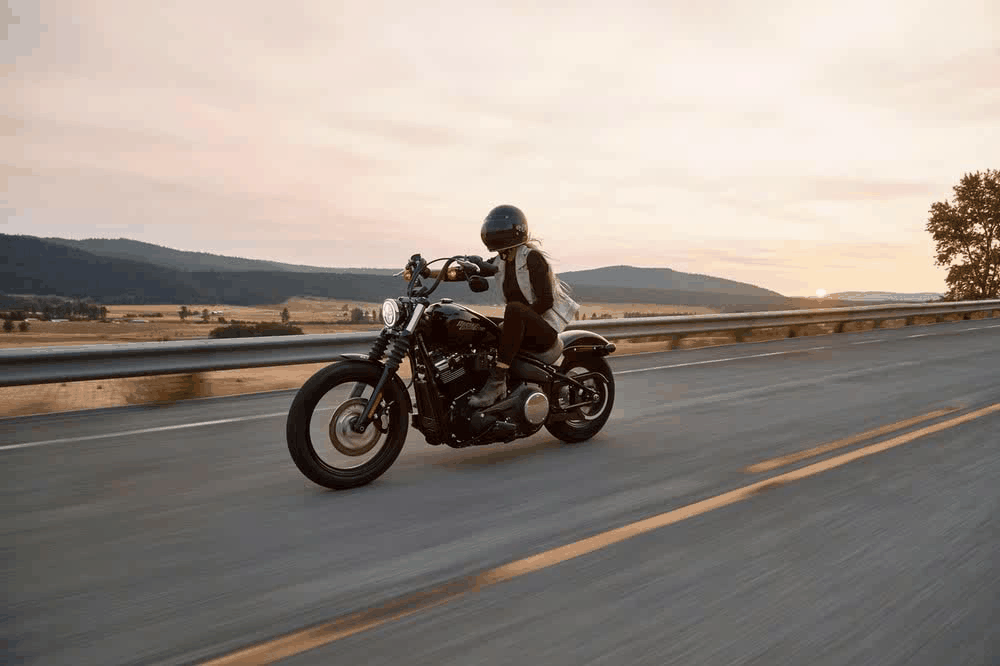

# deep_dream_displayed
Create DeepDream-like images and videos
## Examples
### Still 

### Zoom In


## Getting Started with the Virtual Environment - Pipenv
Installing Pipenv:
```
pip install pipenv
```
Setting up pipenv:
```
pipenv install
```
Using pipenv:
```
pipenv shell
python [file_name]
```

## Dream Images
To generate dream images, put your image in the root directory and change ```dream_image.py```
```
show_dream_image_layer(file_name='your_picture.png', layer=your_desired_dream_layer_number)
```
Then run the file in pipenv shell
```
python dream_image.py
```
More information about the different dream layers inside ```dream_image.py```. 
Examples of different layers inside the ```test``` png images. 
[More information about DeepDream](https://github.com/Hvass-Labs/TensorFlow-Tutorials/blob/master/14_DeepDream.ipynb)

## Dream Video
To generate dream videos, use ```dream_to_vid.py```
1. Generate the frames of the video, pass in your original file, total amount of frames to generate, and your desired dream layer, with optional zoom-in effect:
```
create_dream_frames(file_name='test.png', target_dream_layer=3, total_frames=10,zoom_in=True)
```
2. Use the generated frames and write to a video file and run

## Built with
python 3.5
* [pipenv](https://pypi.org/project/pipenv/)
* [matplotlib](https://pypi.org/project/matplotlib/) 
* [tensorflow](https://www.tensorflow.org/)
* [scipy](https://pypi.org/project/scipy/)
* [OpenCV](https://pypi.org/project/opencv-python/)
* [DeepDream](https://github.com/Hvass-Labs/TensorFlow-Tutorials/blob/master/14_DeepDream.ipynb)
* [MoviePy](https://pypi.org/project/moviepy/)

